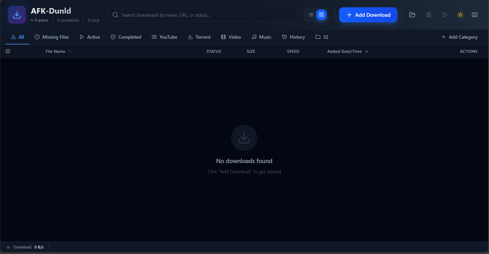
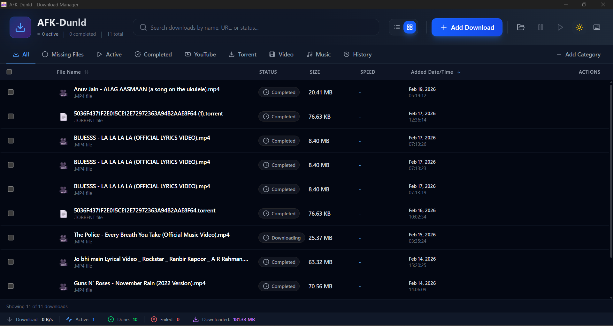

# AFK-Dunld - Advanced Download Manager

<div align="center">


**A powerful, feature-rich download manager with built-in YouTube support**

[](https://tauri.app)
[](https://reactjs.org)
[](https://www.rust-lang.org)
[](https://www.typescriptlang.org)

[Features](#-features) • [Installation](#-installation) • [Usage](#-usage) • [Building](#-building-from-source) • [Documentation](#-documentation)

</div>

---

## ✨ Features

### 🎥 YouTube & Video Downloads
- **Zero Configuration** - yt-dlp bundled, no manual installation required
- **1000+ Websites** - YouTube, Vimeo, Twitter, TikTok, Instagram, and more
- **Playlist Support** - Download entire playlists with one click
- **Quality Selection** - Choose from 4K to 360p for videos
- **Audio Extraction** - Extract MP3, AAC, FLAC, Opus, M4A from videos
- **Auto Updates** - Update yt-dlp without reinstalling the app

### 📥 Advanced Download Management
- **Multi-threaded Downloads** - Split files into segments for faster downloads
- **Resume Support** - Continue interrupted downloads automatically
- **Queue Management** - Control download priorities and concurrent limits
- **Scheduler** - Set downloads to run at specific times or recurring
- **Download History** - Track all downloads with statistics and analytics
- **Batch Downloads** - Add multiple URLs at once

### 🎨 User Interface
- **Modern Design** - Clean, intuitive interface with glassmorphism effects
- **Dark/Light Themes** - Switch between themes based on preference
- **Real-time Progress** - Live speed, ETA, and completion tracking
- **Search & Filter** - Find downloads quickly with advanced filters
- **Keyboard Shortcuts** - Efficient navigation with hotkeys
- **System Tray** - Minimize to tray and continue downloads in background

### 🔧 Advanced Features
- **Auto Error Recovery** - Automatically retry and recover stalled downloads
- **Speed Limiting** - Control bandwidth usage per download or globally
- **Proxy Support** - HTTP, HTTPS, SOCKS5 proxy configurations
- **Checksum Verification** - MD5, SHA-256 verification for downloaded files
- **FTP/SFTP Support** - Download from FTP and SFTP servers
- **Torrent Support** - Download torrents with built-in client
- **Browser Integration** - Chrome and Firefox extensions available

### 📊 Analytics & Monitoring
- **Download Statistics** - Total downloads, data usage, average speeds
- **Performance Graphs** - Visual speed graphs for active downloads
- **History Export** - Export download history to JSON
- **Category Management** - Organize downloads by custom categories
- **System Monitoring** - Disk space and system resource tracking

---

## 🖼️ Screenshots

<div align="center">

### Main Interface


### YouTube Download


### Download History


### Queue Management


</div>

---

## 📦 Installation

### Windows
1. Download `AFK-Dunld-Setup.msi` from [Releases](https://github.com/yourusername/afk-dunld/releases)
2. Run the installer
3. Launch AFK-Dunld from Start Menu
4. Start downloading! 🚀

### macOS
1. Download `AFK-Dunld.dmg` from [Releases](https://github.com/yourusername/afk-dunld/releases)
2. Open the DMG file
3. Drag AFK-Dunld to Applications folder
4. Launch from Applications
5. If prompted by Gatekeeper, right-click and select "Open"

### Linux

**Debian/Ubuntu (DEB)**
```bash
wget https://github.com/yourusername/afk-dunld/releases/download/v0.1.0/afk-dunld_0.1.0_amd64.deb
sudo dpkg -i afk-dunld_0.1.0_amd64.deb
```

**AppImage**
```bash
wget https://github.com/yourusername/afk-dunld/releases/download/v0.1.0/afk-dunld_0.1.0_amd64.AppImage
chmod +x afk-dunld_0.1.0_amd64.AppImage
./afk-dunld_0.1.0_amd64.AppImage
```

---

## 🚀 Quick Start

### Adding a Download
1. Click the **"+ Add Download"** button
2. Paste URL(s) - supports HTTP, HTTPS, FTP, SFTP
3. Choose save location (optional)
4. Click **"Add"** to start downloading

### YouTube Downloads
1. Click **"+ Add Download"**
2. Paste YouTube URL
3. Select **Video** or **Audio Only**
4. Choose quality and format
5. Click **"Add"** to start

### Playlist Downloads
1. Paste a YouTube playlist URL
2. Playlist dialog opens automatically
3. Select format and quality for all videos
4. Click **"Download Playlist"**
5. All videos download sequentially

### Scheduling Downloads
1. Navigate to **Schedule** tab
2. Click **"Add Schedule"**
3. Choose download URL and time
4. Set recurrence (optional)
5. Save schedule

---

## 💻 Usage

### Basic Operations

**Add Download**
- Keyboard: `Ctrl/Cmd + N`
- Click: "Add Download" button
- Paste multiple URLs for batch download

**Pause/Resume**
- Pause All: `Ctrl/Cmd + P`
- Resume All: `Ctrl/Cmd + R`
- Individual: Right-click download

**Open File**
- Double-click completed download
- Right-click → "Open File"
- Right-click → "Open File Location"

### Advanced Features

**Queue Management**
1. Go to **Queue** tab
2. Adjust max concurrent downloads
3. Drag to reorder (change priority)
4. Pause/Resume all downloads

**Download History**
1. Go to **History** tab
2. View statistics dashboard
3. Search by filename or URL
4. Export history to JSON

**Settings**
1. Click gear icon or press `Ctrl/Cmd + ,`
2. Configure download defaults
3. Set speed limits
4. Update yt-dlp
5. Customize themes

---

## 🛠️ Building from Source

### Prerequisites
- **Node.js** 18+ ([Download](https://nodejs.org))
- **Rust** 1.70+ ([Install](https://rustup.rs))
- **Tauri Prerequisites** ([Guide](https://tauri.app/v1/guides/getting-started/prerequisites))

### Clone Repository
```bash
git clone https://github.com/yourusername/afk-dunld.git
cd afk-dunld
```

### Install Dependencies
```bash
npm install
```

### Development Build
```bash
npm run tauri dev
```

### Production Build
```bash
# Platform-specific (recommended - smaller size)
npm run tauri build

# Universal (all platforms - larger size)
# Windows
set YTDLP_BUNDLE_ALL_PLATFORMS=1
npm run tauri build

# Linux/macOS
export YTDLP_BUNDLE_ALL_PLATFORMS=1
npm run tauri build
```

### Build Output
- **Windows:** `src-tauri/target/release/bundle/msi/`
- **macOS:** `src-tauri/target/release/bundle/dmg/`
- **Linux:** `src-tauri/target/release/bundle/deb/` and `appimage/`

---

## 📋 System Requirements

### Minimum
- **OS:** Windows 10, macOS 10.13+, Ubuntu 20.04+
- **RAM:** 4 GB
- **Storage:** 500 MB free space
- **Network:** Internet connection

### Recommended
- **OS:** Windows 11, macOS 12+, Ubuntu 22.04+
- **RAM:** 8 GB or more
- **Storage:** 1 GB free space
- **Network:** Broadband connection

---

## 🎯 Supported Platforms

### Download Protocols
- ✅ HTTP/HTTPS
- ✅ FTP/FTPS
- ✅ SFTP
- ✅ Torrents (Magnet & .torrent files)
- ✅ YouTube & 1000+ video sites

### Video Platforms
- YouTube, YouTube Music
- Vimeo, Dailymotion
- Twitch, Twitter/X
- Facebook, Instagram
- TikTok, Reddit
- SoundCloud, Bandcamp
- And many more!

[Full list of supported sites](https://github.com/yt-dlp/yt-dlp/blob/master/supportedsites.md)

---

## 📚 Documentation

### User Guides
- [Quick Start Guide](docs/QUICK_START.md)
- [YouTube Download Guide](docs/YOUTUBE_GUIDE.md)
- [Advanced Features](docs/ADVANCED_FEATURES.md)
- [Troubleshooting](docs/TROUBLESHOOTING.md)

### Developer Guides
- [Architecture Overview](docs/ARCHITECTURE.md)
- [API Documentation](docs/API.md)
- [Contributing Guide](CONTRIBUTING.md)
- [Build Guide](docs/BUILD_GUIDE.md)

### Technical Documentation
- [yt-dlp Bundling](YTDLP_BUNDLING_GUIDE.md)
- [Bundle Optimization](BUILD_OPTIMIZATION_GUIDE.md)
- [Implementation Details](BUNDLED_YTDLP_IMPLEMENTATION.md)

---

## ⌨️ Keyboard Shortcuts

| Action | Windows/Linux | macOS |
|--------|---------------|-------|
| Add Download | `Ctrl + N` | `Cmd + N` |
| Pause All | `Ctrl + P` | `Cmd + P` |
| Resume All | `Ctrl + R` | `Cmd + R` |
| Settings | `Ctrl + ,` | `Cmd + ,` |
| Search | `Ctrl + F` | `Cmd + F` |
| Refresh | `F5` | `Cmd + R` |
| Open File | `Enter` | `Enter` |
| Delete Download | `Delete` | `Delete` |
| Show Shortcuts | `?` | `?` |

---

## 🔧 Configuration

### Default Settings Location
- **Windows:** `%APPDATA%\com.ankit.afk-dunld\`
- **macOS:** `~/Library/Application Support/com.ankit.afk-dunld/`
- **Linux:** `~/.local/share/com.ankit.afk-dunld/`

### yt-dlp Binary Location
- **Windows:** `%APPDATA%\afk-dunld\bin\yt-dlp.exe`
- **macOS:** `~/Library/Application Support/afk-dunld/bin/yt-dlp`
- **Linux:** `~/.local/share/afk-dunld/bin/yt-dlp`

### Database
- SQLite database: `downloads.db`
- Automatic migrations on version updates
- Backup recommended before updates

---

## 🤝 Contributing

We welcome contributions! Please see our [Contributing Guide](CONTRIBUTING.md) for details.

### How to Contribute
1. Fork the repository
2. Create a feature branch (`git checkout -b feature/amazing-feature`)
3. Commit your changes (`git commit -m 'Add amazing feature'`)
4. Push to the branch (`git push origin feature/amazing-feature`)
5. Open a Pull Request

### Development Guidelines
- Follow TypeScript/Rust best practices
- Add tests for new features
- Update documentation
- Follow commit message conventions

---

## 🐛 Bug Reports & Feature Requests

### Found a Bug?
1. Check [existing issues](https://github.com/yourusername/afk-dunld/issues)
2. Create a new issue with:
   - Clear description
   - Steps to reproduce
   - Expected vs actual behavior
   - Screenshots if applicable
   - System information

### Want a Feature?
1. Check [feature requests](https://github.com/yourusername/afk-dunld/issues?q=is%3Aissue+is%3Aopen+label%3Aenhancement)
2. Open a new issue with:
   - Clear use case
   - Expected behavior
   - Benefits to users

---

## 📜 License

This project is licensed under the MIT License - see the [LICENSE](LICENSE) file for details.

### Third-Party Licenses
- **yt-dlp:** [Unlicense](https://github.com/yt-dlp/yt-dlp/blob/master/LICENSE)
- **Tauri:** [Apache-2.0/MIT](https://github.com/tauri-apps/tauri/blob/dev/LICENSE_APACHE)
- **React:** [MIT](https://github.com/facebook/react/blob/main/LICENSE)

---

## 🙏 Acknowledgments

### Built With
- [Tauri](https://tauri.app) - Build smaller, faster, and more secure desktop applications
- [React](https://reactjs.org) - A JavaScript library for building user interfaces
- [Rust](https://www.rust-lang.org) - A language empowering everyone to build reliable and efficient software
- [yt-dlp](https://github.com/yt-dlp/yt-dlp) - A youtube-dl fork with additional features

### Special Thanks
- yt-dlp community for the amazing tool
- Tauri team for the excellent framework
- All contributors and users

---

## 📞 Support

### Get Help
- 📖 [Documentation](docs/)
- 💬 [Discussions](https://github.com/yourusername/afk-dunld/discussions)
- 🐛 [Issue Tracker](https://github.com/yourusername/afk-dunld/issues)
- 📧 Email: support@afk-dunld.com

### Community
- [Discord Server](https://discord.gg/afk-dunld)
- [Reddit Community](https://reddit.com/r/afkdunld)
- [Twitter](https://twitter.com/afkdunld)

---

## 📊 Project Stats


---

## 🗺️ Roadmap

### Version 1.0 (Current)
- ✅ Bundled yt-dlp
- ✅ Download history
- ✅ Playlist support
- ✅ Queue management
- ✅ Scheduler
- ✅ Theme toggle
- ✅ Error recovery

### Version 1.1 (Planned)
- [ ] Browser extension (Chrome/Firefox)
- [ ] Cloud sync
- [ ] Mobile companion app
- [ ] Download categories auto-sorting
- [ ] Advanced statistics dashboard

### Version 2.0 (Future)
- [ ] RSS feed monitoring
- [ ] Bandwidth scheduler
- [ ] Remote control API
- [ ] Multi-language support
- [ ] Plugin system

---

## 💝 Donate

If you find AFK-Dunld useful, consider supporting development:

- ☕ [Buy Me a Coffee](buymeacoffee.com/ankitulak)
- 💳 [esewa](9803281897)
- 🪙 Bitcoin: `Not available`

---

## 📝 Changelog

See [CHANGELOG.md](CHANGELOG.md) for a list of changes in each version.

---

<div align="center">

**Made with ❤️ by the Ankit Ulak**

[Website](https://ankitulak.com.np) • [Documentation](docs/) • [Blog](https://ankitulak.com.np/blog)

© 2024 AFK Downloads. All rights reserved.

</div>
